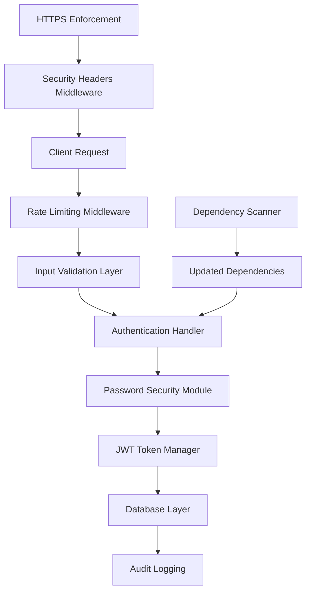

# Authentication Security Audit Design Document

## Overview

This design document outlines the comprehensive security audit and enhancement of the authentication system. Based on analysis of the current implementation, several critical security vulnerabilities and outdated practices have been identified that require immediate attention.

### Current Security Issues Identified

1. **Weak Secret Key**: Using a default/weak secret key for JWT signing
2. **Outdated Dependencies**: Multiple packages are using older versions with known vulnerabilities
3. **Missing Rate Limiting**: No protection against brute force attacks
4. **Insufficient Password Hashing**: Using fallback to pbkdf2_sha256 instead of bcrypt
5. **Missing Security Headers**: No HTTPS enforcement or security headers
6. **Inadequate Input Validation**: Limited sanitization and validation
7. **No Account Lockout**: Missing protection against repeated failed attempts
8. **Insecure Token Expiration**: 30-minute tokens may be too long for sensitive operations

## Architecture

### Security Enhancement Layers



### Enhanced Authentication Flow

1. **Request Processing**: HTTPS enforcement and security headers
2. **Rate Limiting**: IP-based and user-based rate limiting
3. **Input Validation**: Comprehensive sanitization and validation
4. **Authentication**: Secure password verification with constant-time comparison
5. **Token Management**: Secure JWT generation with proper expiration
6. **Audit Logging**: Complete security event logging

## Components and Interfaces

### 1. Password Security Module

**Enhanced Password Hashing**
- Primary: bcrypt with work factor 12 (minimum)
- Automatic salt generation per password
- Constant-time password verification
- Password strength validation

```python
class PasswordSecurity:
    def hash_password(self, password: str) -> str
    def verify_password(self, password: str, hash: str) -> bool
    def validate_password_strength(self, password: str) -> bool
```

### 2. Rate Limiting Service

**Multi-layer Rate Limiting**
- IP-based rate limiting (100 requests/minute)
- Authentication endpoint limiting (5 attempts/minute)
- Account lockout after failed attempts
- Exponential backoff implementation

```python
class RateLimitService:
    def check_ip_rate_limit(self, ip: str) -> bool
    def check_auth_rate_limit(self, identifier: str) -> bool
    def record_failed_attempt(self, identifier: str) -> None
    def is_account_locked(self, identifier: str) -> bool
```

### 3. JWT Security Manager

**Enhanced Token Security**
- Cryptographically secure secret keys
- Shorter token expiration (15 minutes)
- Token refresh mechanism
- Secure token validation

```python
class JWTSecurityManager:
    def create_access_token(self, data: dict) -> str
    def create_refresh_token(self, data: dict) -> str
    def verify_token(self, token: str) -> Optional[dict]
    def refresh_access_token(self, refresh_token: str) -> str
```

### 4. Input Validation Service

**Comprehensive Input Sanitization**
- SQL injection prevention
- XSS attack prevention
- Email format validation
- Username/password format validation

```python
class InputValidator:
    def sanitize_input(self, input_data: str) -> str
    def validate_email(self, email: str) -> bool
    def validate_username(self, username: str) -> bool
    def validate_password_format(self, password: str) -> bool
```

### 5. Security Middleware

**HTTP Security Headers**
- HSTS (HTTP Strict Transport Security)
- CSP (Content Security Policy)
- X-Frame-Options
- X-Content-Type-Options
- Secure cookie settings

```python
class SecurityMiddleware:
    def add_security_headers(self, response: Response) -> Response
    def enforce_https(self, request: Request) -> None
    def set_secure_cookies(self, response: Response) -> Response
```

## Data Models

### Enhanced User Model

**Additional Security Fields**
```python
class User(Base):
    # Existing fields...
    failed_login_attempts: int = 0
    account_locked_until: Optional[datetime] = None
    last_login: Optional[datetime] = None
    password_changed_at: datetime
    login_attempts_reset_at: Optional[datetime] = None
```

### Security Audit Log Model

**Comprehensive Audit Logging**
```python
class SecurityAuditLog(Base):
    id: int
    user_id: Optional[int]
    ip_address: str
    user_agent: str
    action: str  # login_success, login_failed, password_changed, etc.
    details: Optional[str]
    timestamp: datetime
    risk_level: str  # low, medium, high, critical
```

## Error Handling

### Security-Focused Error Responses

1. **Generic Error Messages**: Avoid revealing system internals
2. **Rate Limiting Responses**: Clear indication of limits exceeded
3. **Authentication Failures**: Generic "invalid credentials" messages
4. **Account Lockout**: Clear indication of lockout status and duration

### Error Response Format
```python
class SecurityErrorResponse:
    error_code: str
    message: str
    retry_after: Optional[int]  # For rate limiting
    locked_until: Optional[datetime]  # For account lockout
```

## Testing Strategy

### Comprehensive Test-Driven Security Implementation

**Testing Requirements:**
- All existing unit tests MUST continue to pass throughout implementation
- New unit tests MUST be created incrementally for each security feature
- Tests MUST be run via Docker testing script to ensure consistency
- Each implementation step MUST include corresponding test validation
- No security feature is considered complete without passing tests

### Security Testing Approach

1. **Password Security Tests**
   - Bcrypt functionality verification with work factor 12
   - Salt uniqueness validation across multiple password hashes
   - Constant-time comparison testing to prevent timing attacks
   - Password strength validation with comprehensive rules
   - Backward compatibility with existing password hashes
   - Performance testing for bcrypt work factor impact

2. **Rate Limiting Tests**
   - IP-based rate limit enforcement with various scenarios
   - Authentication rate limit testing with multiple users
   - Account lockout mechanism validation with timing
   - Exponential backoff verification with precise timing
   - Rate limit reset functionality testing
   - Concurrent request handling under rate limits

3. **JWT Security Tests**
   - Token signature validation with various tampering attempts
   - Expiration time enforcement with edge cases
   - Refresh token mechanism with security validation
   - Token tampering detection and proper error responses
   - Secure key rotation testing
   - Token blacklisting functionality

4. **Input Validation Tests**
   - SQL injection prevention with comprehensive attack vectors
   - XSS attack prevention with various payload types
   - Email validation accuracy with edge cases
   - Username/password format validation with boundary conditions
   - Unicode and special character handling
   - Input sanitization effectiveness

5. **Integration Security Tests**
   - End-to-end authentication flow with all security measures
   - Security headers verification in all responses
   - HTTPS enforcement testing with various scenarios
   - Audit logging validation with complete event coverage
   - Cross-component security interaction testing
   - Performance impact assessment of security measures

6. **Dependency Security Tests**
   - Vulnerability scanning validation for all updated packages
   - Compatibility testing between updated dependencies
   - Performance regression testing after updates
   - Security patch verification for critical vulnerabilities

### Incremental Testing Approach

**Phase 1 Testing (Critical Security Fixes)**
- Dependency update compatibility tests
- Bcrypt implementation tests with existing data
- Secret key security validation tests
- Basic rate limiting functionality tests

**Phase 2 Testing (Enhanced Security Features)**
- Input validation comprehensive test suite
- Security headers middleware tests
- Account lockout mechanism tests
- Security audit logging tests

**Phase 3 Testing (Advanced Security Measures)**
- Token refresh mechanism tests
- Advanced penetration testing scenarios
- Security monitoring functionality tests
- Complete integration test suite

### Test Execution Requirements

**Docker Test Environment:**
- All tests MUST be executed using the existing Docker testing script
- Test environment MUST mirror production security configuration
- Database state MUST be properly managed between test runs
- Test data MUST include security-relevant scenarios

**Continuous Testing:**
- Tests MUST be run after each implementation step
- Failing tests MUST be addressed before proceeding to next step
- Test coverage MUST be maintained above 90% for security components
- Performance benchmarks MUST be established and maintained

### Penetration Testing Scenarios

1. **Brute Force Attack Simulation**
   - Automated login attempts with rate limiting validation
   - Account lockout mechanism effectiveness
   - IP-based blocking functionality

2. **Token Manipulation Attempts**
   - JWT signature tampering detection
   - Token expiration bypass attempts
   - Refresh token abuse scenarios

3. **SQL Injection Testing**
   - Authentication endpoint injection attempts
   - User registration injection vectors
   - Profile update injection scenarios

4. **XSS Attack Vectors**
   - Input field XSS payload testing
   - Response header XSS prevention
   - Stored XSS prevention validation

5. **Session Hijacking Attempts**
   - Token theft simulation
   - Session fixation prevention
   - Cross-site request forgery protection

## Dependency Updates

### Critical Security Updates Required

Based on analysis of current requirements.txt, the following updates are needed:

**High Priority Security Updates:**
- `fastapi`: 0.104.1 → 0.104.2+ (security patches)
- `python-jose`: 3.3.0 → 3.3.0+ (check for newer versions)
- `bcrypt`: 4.0.1 → 4.1.2+ (latest security patches)
- `passlib`: 1.7.4 → 1.7.4+ (verify latest)
- `pydantic`: 2.4.2 → 2.5.0+ (security and validation improvements)

**Medium Priority Updates:**
- `sqlalchemy`: 2.0.23 → 2.0.25+ (performance and security)
- `uvicorn`: 0.24.0 → 0.24.0+ (check for updates)
- `psycopg2-binary`: 2.9.7 → 2.9.9+ (database security)

**All Dependencies**: Complete audit and update to latest stable versions

### Dependency Security Scanning

Implementation of automated vulnerability scanning:
- Integration with `safety` package for Python vulnerability scanning
- Regular dependency update checks
- Automated security patch notifications

## Implementation Phases

### Phase 1: Critical Security Fixes (Test-Driven)
1. **Update all dependencies** with compatibility testing
   - Run existing test suite to establish baseline
   - Update dependencies incrementally with test validation
   - Create dependency security validation tests
2. **Implement proper bcrypt configuration** with comprehensive testing
   - Create bcrypt functionality tests
   - Implement work factor 12 with performance testing
   - Validate backward compatibility with existing passwords
3. **Replace weak secret key** with security validation
   - Generate cryptographically secure key
   - Test JWT functionality with new key
   - Validate token security improvements
4. **Add basic rate limiting** with thorough testing
   - Implement IP-based rate limiting with tests
   - Add authentication endpoint limiting with validation
   - Test rate limit effectiveness and edge cases

### Phase 2: Enhanced Security Features (Incremental Testing)
1. **Implement comprehensive input validation** with security tests
   - Create input validation test suite
   - Implement SQL injection prevention with attack simulation
   - Add XSS prevention with payload testing
2. **Add security headers middleware** with verification tests
   - Implement security headers with response validation
   - Test HTTPS enforcement functionality
   - Validate security header effectiveness
3. **Implement account lockout mechanism** with timing tests
   - Create account lockout tests with precise timing
   - Implement lockout logic with edge case testing
   - Test lockout reset functionality
4. **Add security audit logging** with comprehensive coverage
   - Implement audit logging with event validation
   - Test log completeness and accuracy
   - Validate log security and integrity

### Phase 3: Advanced Security Measures (Complete Validation)
1. **Implement token refresh mechanism** with security testing
   - Create refresh token tests with security validation
   - Implement refresh logic with attack simulation
   - Test token lifecycle management
2. **Add comprehensive penetration testing** with automated validation
   - Implement automated security test suite
   - Run penetration testing scenarios
   - Validate security measure effectiveness
3. **Implement automated security monitoring** with alerting tests
   - Create security monitoring tests
   - Implement monitoring logic with validation
   - Test alerting and response mechanisms
4. **Complete integration testing** with full system validation
   - Run complete test suite with all security measures
   - Validate system performance under security constraints
   - Ensure all existing functionality remains intact

### Testing Validation Requirements

**After Each Phase:**
- All existing tests MUST pass
- New security tests MUST pass
- Docker test script MUST complete successfully
- Performance benchmarks MUST be maintained
- Security validation MUST be confirmed

## Security Configuration

### Environment Variables
```bash
# JWT Security
SECRET_KEY=<cryptographically-secure-256-bit-key>
ALGORITHM=HS256
ACCESS_TOKEN_EXPIRE_MINUTES=15
REFRESH_TOKEN_EXPIRE_DAYS=7

# Password Security
BCRYPT_ROUNDS=12
PASSWORD_MIN_LENGTH=8
PASSWORD_REQUIRE_SPECIAL=true

# Rate Limiting
MAX_LOGIN_ATTEMPTS=5
LOCKOUT_DURATION_MINUTES=30
IP_RATE_LIMIT_PER_MINUTE=100
AUTH_RATE_LIMIT_PER_MINUTE=5

# Security Headers
ENABLE_HSTS=true
HSTS_MAX_AGE=31536000
ENABLE_CSP=true
FRAME_OPTIONS=DENY
```

This design provides a comprehensive security enhancement that addresses all identified vulnerabilities while maintaining system performance and usability.
