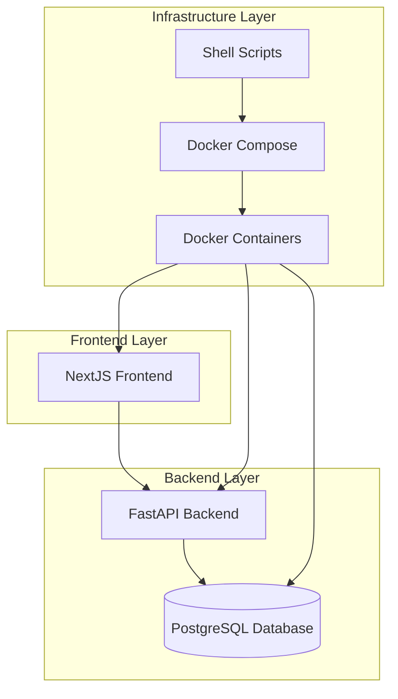

# Design Document

## Overview

Cody Richter Cooks is a full-stack web application that enables users to create, share, and discover recipes. The system follows a microservices architecture with clear separation between frontend, backend, and infrastructure concerns. All development and deployment operations are containerized using Docker to ensure consistency across environments.

## Architecture

### High-Level Architecture



### Service Architecture

- **Frontend Service**: NextJS application serving the user interface
- **Backend Service**: FastAPI application providing REST APIs
- **Database Service**: PostgreSQL database for data persistence
- **Development Scripts**: Shell scripts for automated operations

## Components and Interfaces

### Backend Structure

```
backend/
├── app/
│   ├── __init__.py
│   ├── main.py                 # FastAPI application entry point
│   ├── core/
│   │   ├── __init__.py
│   │   ├── config.py           # Application configuration
│   │   └── database.py         # Database connection setup
│   ├── models/
│   │   ├── __init__.py
│   │   ├── user.py             # User SQLAlchemy model
│   │   ├── recipe.py           # Recipe SQLAlchemy model
│   │   ├── recipe_permission.py # RecipePermission SQLAlchemy model
│   │   ├── ingredient.py       # Ingredient SQLAlchemy model
│   │   └── instruction.py      # Instruction SQLAlchemy model
│   ├── schemas/
│   │   ├── __init__.py
│   │   ├── user.py             # User Pydantic schemas
│   │   ├── recipe.py           # Recipe Pydantic schemas
│   │   ├── recipe_permission.py # RecipePermission Pydantic schemas
│   │   ├── ingredient.py       # Ingredient Pydantic schemas
│   │   └── instruction.py      # Instruction Pydantic schemas
│   ├── handlers/
│   │   ├── __init__.py
│   │   ├── users/
│   │   │   ├── __init__.py
│   │   │   └── routes.py       # User API endpoints
│   │   └── recipes/
│   │       ├── __init__.py
│   │       └── routes.py       # Recipe API endpoints
│   └── utils/
│       ├── __init__.py
│       ├── auth.py             # Authentication utilities
│       ├── file_upload.py      # Image upload and processing utilities
│       ├── html_sanitizer.py   # HTML content sanitization
│       └── helpers.py          # General utility functions
├── alembic/                    # Database migration files
├── requirements.txt            # Python dependencies
└── Dockerfile                  # Backend container configuration
```

### Frontend Structure

```
frontend/
├── src/
│   ├── app/
│   │   ├── layout.tsx          # Root layout component
│   │   ├── page.tsx            # Home page
│   │   ├── recipes/
│   │   │   ├── page.tsx        # Recipe listing page
│   │   │   ├── [id]/
│   │   │   │   └── page.tsx    # Recipe detail page
│   │   │   └── create/
│   │   │       └── page.tsx    # Recipe creation page
│   │   └── auth/
│   │       ├── login/
│   │       │   └── page.tsx    # Login page
│   │       └── register/
│   │           └── page.tsx    # Registration page
│   ├── components/
│   │   ├── ui/                 # Reusable UI components
│   │   ├── recipe/             # Recipe-specific components
│   │   ├── editor/             # WYSIWYG editor components
│   │   └── auth/               # Authentication components
│   ├── lib/
│   │   ├── api.ts              # API client functions
│   │   └── types.ts            # TypeScript type definitions
│   └── utils/
│       └── helpers.ts          # Utility functions
├── package.json                # Node.js dependencies
├── next.config.js              # NextJS configuration
└── Dockerfile                  # Frontend container configuration
```

### Infrastructure Structure

```
infrastructure/
├── docker-compose.yml          # Service orchestration
├── docker-compose.dev.yml      # Development overrides
├── backend.Dockerfile          # Backend container definition
├── frontend.Dockerfile         # Frontend container definition
└── postgres/
    └── init.sql                # Database initialization
```

### Development Scripts

```
scripts/
├── dev-start.sh                # Start development environment
├── dev-stop.sh                 # Stop development environment
├── migrate.sh                  # Run database migrations
├── migrate-create.sh           # Create new migration
├── build.sh                    # Build all containers
└── cleanup.sh                  # Clean up Docker resources
```

## Data Models

### User Model

```python
class User(Base):
    id: int (Primary Key)
    username: str (Unique, Not Null, Index)
    email: str (Unique, Not Null, Index)
    password_hash: str (Not Null)
    created_at: datetime
    updated_at: datetime

    # Relationships
    recipe_permissions: List[RecipePermission] (One-to-Many)
    uploaded_images: List[RecipeImage] (One-to-Many)

    # Database Indices
    __table_args__ = (
        Index('idx_user_username', 'username'),
        Index('idx_user_email', 'email'),
    )
```

### Recipe Model

```python
class Recipe(Base):
    id: int (Primary Key)
    title: str (Not Null, Index)
    description: Text (HTML content with embedded images)
    cooking_time: int (minutes)
    serving_size: int
    created_at: datetime (Index)
    updated_at: datetime

    # Relationships
    user_permissions: List[RecipePermission] (One-to-Many)
    ingredients: List[Ingredient] (One-to-Many)
    instructions: List[Instruction] (One-to-Many)
    images: List[RecipeImage] (One-to-Many)

    # Database Indices
    __table_args__ = (
        Index('idx_recipe_title_search', 'title'),
        Index('idx_recipe_created_at', 'created_at'),
        Index('idx_recipe_cooking_time', 'cooking_time'),
    )
```

### RecipePermission Model (Association Table)

```python
class RecipePermission(Base):
    id: int (Primary Key)
    user_id: int (Foreign Key to User, Index)
    recipe_id: int (Foreign Key to Recipe, Index)
    role: str (Enum: 'owner', 'editor')
    granted_at: datetime
    granted_by: int (Foreign Key to User, optional)

    # Relationships
    user: User (Many-to-One)
    recipe: Recipe (Many-to-One)
    granter: User (Many-to-One, optional)

    # Database Indices and Constraints
    __table_args__ = (
        UniqueConstraint('user_id', 'recipe_id'),
        Index('idx_permission_user_recipe', 'user_id', 'recipe_id'),
        Index('idx_permission_recipe_role', 'recipe_id', 'role'),
    )
```

### RecipeImage Model

```python
class RecipeImage(Base):
    id: int (Primary Key)
    recipe_id: int (Foreign Key to Recipe, Index)
    filename: str (Not Null)
    original_filename: str (Not Null)
    file_path: str (Not Null)
    file_size: int (bytes)
    mime_type: str (Not Null)
    alt_text: str (optional)
    uploaded_at: datetime
    uploaded_by: int (Foreign Key to User)

    # Relationships
    recipe: Recipe (Many-to-One)
    uploader: User (Many-to-One)

    # Database Indices
    __table_args__ = (
        Index('idx_image_recipe', 'recipe_id'),
        Index('idx_image_filename', 'filename'),
    )
```

### Ingredient Model

```python
class Ingredient(Base):
    id: int (Primary Key)
    name: str (Not Null, Index)
    quantity: float
    unit: str
    recipe_id: int (Foreign Key to Recipe, Index)

    # Relationships
    recipe: Recipe (Many-to-One)

    # Database Indices
    __table_args__ = (
        Index('idx_ingredient_recipe', 'recipe_id'),
        Index('idx_ingredient_name', 'name'),
    )
```

### Instruction Model

```python
class Instruction(Base):
    id: int (Primary Key)
    step_number: int (Not Null)
    description: Text (HTML content with embedded images)
    timing: int (minutes, optional)
    recipe_id: int (Foreign Key to Recipe, Index)

    # Relationships
    recipe: Recipe (Many-to-One)

    # Database Indices
    __table_args__ = (
        Index('idx_instruction_recipe_step', 'recipe_id', 'step_number'),
    )
```

### API Endpoints

#### User API (`/api/users`)
- `POST /register` - User registration
- `POST /login` - User authentication
- `GET /profile` - Get user profile
- `PUT /profile` - Update user profile

#### Recipe API (`/api/recipes`)
- `GET /` - List recipes with pagination and search
- `POST /` - Create new recipe (user becomes owner)
- `GET /{id}` - Get recipe by ID
- `PUT /{id}` - Update recipe (requires owner or editor permission)
- `DELETE /{id}` - Delete recipe (requires owner permission)
- `GET /user/{user_id}` - Get recipes by user (owned and editable)
- `POST /{id}/permissions` - Grant recipe permissions to user
- `DELETE /{id}/permissions/{user_id}` - Remove recipe permissions
- `GET /{id}/permissions` - List recipe permissions

#### Image API (`/api/images`)
- `POST /upload` - Upload image for recipe content
- `GET /{image_id}` - Serve image file
- `DELETE /{image_id}` - Delete image (requires permission)
- `GET /recipe/{recipe_id}` - List images for recipe

#### System API (`/api/system`)
- `GET /health` - Health check endpoint for monitoring and development

## Error Handling

### Backend Error Handling
- Custom exception classes for different error types
- Global exception handler middleware
- Structured error responses with consistent format
- Logging integration for error tracking

### Frontend Error Handling
- Error boundary components for React error catching
- API error handling with user-friendly messages
- Loading states and error states for all async operations
- Form validation with real-time feedback

## Testing Strategy

### Backend Testing
- Unit tests for models, schemas, and utility functions
- Integration tests for API endpoints
- Database tests with test database isolation
- Authentication and authorization tests

### Frontend Testing
- Component unit tests with React Testing Library
- Integration tests for page flows
- API integration tests with mock backend
- End-to-end tests for critical user journeys

### Docker Testing
- Container build verification
- Service connectivity tests
- Migration script validation
- Development script functionality tests

## Rich Content and Image Handling

### WYSIWYG Editor Integration
- Frontend uses rich text editor (e.g., TinyMCE, Quill, or Tiptap)
- Supports HTML formatting: bold, italic, lists, headings
- Inline image embedding with drag-and-drop upload
- Real-time preview of formatted content

### Image Storage Strategy
- Images uploaded to server file system or cloud storage
- Unique filename generation to prevent conflicts
- Image optimization and resizing for web delivery
- Support for multiple image formats (JPEG, PNG, WebP)

### HTML Content Security
- Server-side HTML sanitization to prevent XSS attacks
- Whitelist of allowed HTML tags and attributes
- Image URL validation and security checks
- Content-Security-Policy headers for additional protection

### Database Optimization
- Strategic indexing on frequently queried fields
- Composite indices for complex queries (user + recipe lookups)
- Full-text search capabilities for recipe titles and ingredients
- Optimized queries for recipe listing and filtering

## Development Workflow

### Docker-Based Development
1. All services run in Docker containers
2. Hot-reloading enabled for both frontend and backend
3. Database runs in container with persistent volumes
4. No local installation of runtime dependencies required

### Shell Script Operations
- `./scripts/dev-start.sh` - Starts complete development environment
- `./scripts/migrate.sh` - Runs database migrations through Docker
- `./scripts/migrate-create.sh "description"` - Creates new migration
- `./scripts/build.sh` - Builds all Docker images
- `./scripts/cleanup.sh` - Removes containers and unused images

### Environment Configuration
- Environment variables for database connection
- Separate configurations for development, testing, and production
- Docker Compose overrides for different environments
- Secrets management for sensitive configuration

### CORS and Development Setup
- CORS middleware configured for local development
- Allowed origins configurable via environment variables
- Development-friendly CORS settings for frontend-backend communication
- Health check endpoint for service monitoring and development verification
